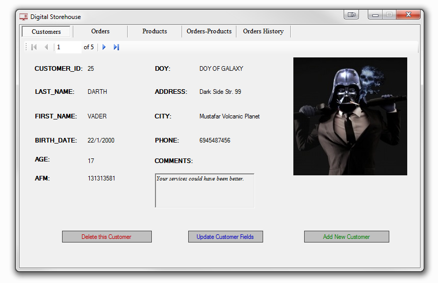
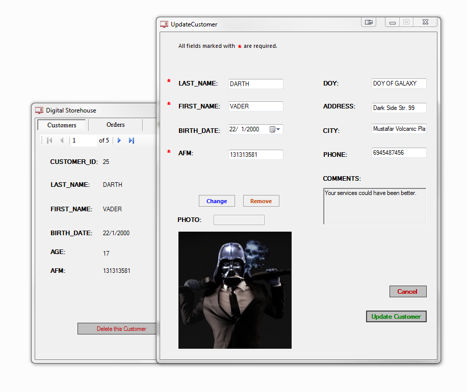
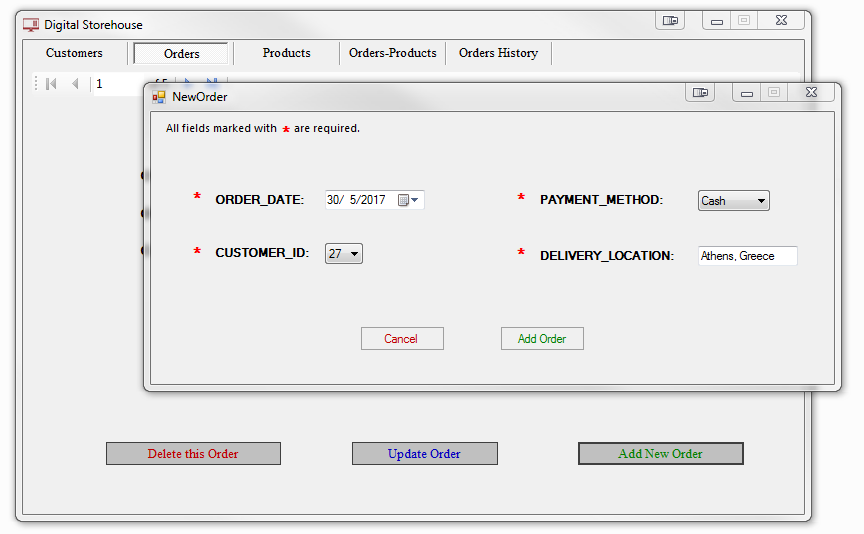
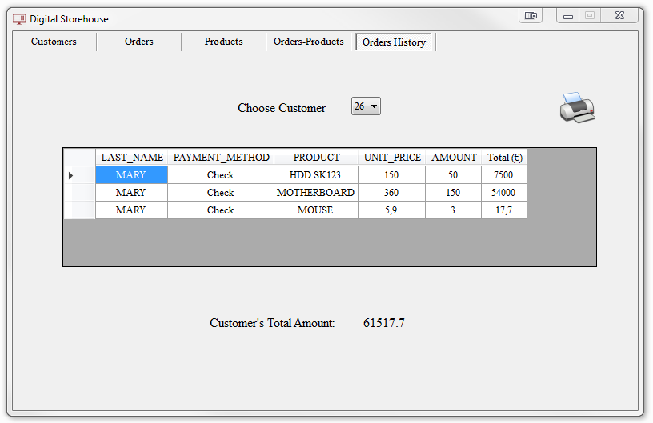

# Digital_Storehouse
Visual C# - MS SQL
 

<h3> High quality GUI software for simple customer and product management.</h3>

<h4>Technologies used:</h4>

<ul>
  <li>
        <b>C# - VS2017 / ReSharper</b> 
  </li>
  <li>
        <b>SQL Server / Microsoft SQL Management Studio 17</b> 
  </li>
  <li>
        <b>MVC Design</b> 
  </li>
</ul>

 

<i>Nikiforos Archakis, BEng  
May 2017, Thessaloniki - Greece</i>

 
 

